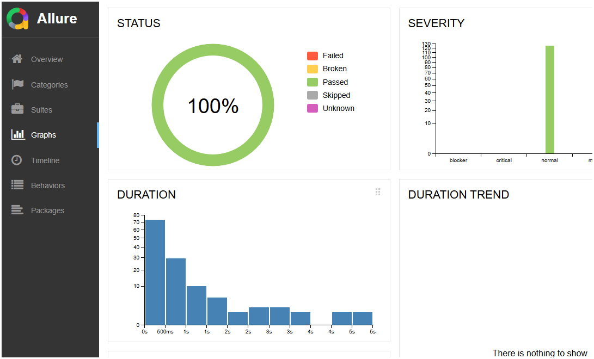

# 🌐 Cypress Interview Test Project

This project is a **demonstration Cypress automation framework** built for interview purposes.
It showcases a **moderate-level framework** using the **Page Object Model (POM)** design pattern for an **e-commerce application**.

---

## 📂 Project Structure

```
project-root/
│
├── cypress.config.js          # Cypress configuration (v10+)
│
├── cypress/
│   ├── e2e/                   # Test layer
│   │   ├── pages/             # Page Object classes (POM design)
│   │   └── tests/             # Test specs (grouped, tagged, parameterized)
│   │
│   ├── fixtures/              # Static test data (JSON, mock payloads, etc.)
│   │   └── users.json
│   │
│   ├── support/               # Cypress support layer
│   │   ├── commands.js        # Custom Cypress commands
│   │   └── e2e.js             # Global setup & hooks
│   │
│   ├── utils/                 # Utilities & dynamic test data
│   │   ├── apiHelpers.js
│   │   └── dataGenerators.js
│   │
│   ├── downloads/             # Downloaded files for validation
│   ├── screenshots/           # Auto-captured screenshots on failure
│   └── videos/                # Auto-recorded videos of test runs
│
├── package.json               # Project dependencies
├── .gitignore                 # Ignore files for Git
└── README.md                  # Project documentation

```

---

## 🚀 Setup & Usage [https://docs.cypress.io/app/get-started/install-cypress]

🌟 Check Requirements: make sure you meet the system requirements including operating system, installation of Node.js and a supported package manager.

1. **Install dependencies**

   ```bash
   npm install cypress --save-dev
   ```

2. **Run tests in interactive mode**

   ```bash
   npx cypress open
   ```

3. **Run tests in headless mode**

   ```bash
   npx cypress run
   ```

4. **Run a specific spec**

   ```bash
   npx cypress run --spec "cypress/e2e/tests/todo.cy.js"
   ```

---

## 🧪 Test Types & Tagging

* **Smoke, Sanity, Regression** → grouped and tagged in test files.
* **Parameterization** → dynamic test data with fixtures & utils.
* **Custom Commands** → reusable steps in `support/commands.js`.
* **Page Object Model** → maintainable test design with `pages/`.

---

## 📊 Reporting

This project supports multiple reporting integrations:

* **Mochawesome / HTML reports**
* **Allure reports** (with plugin setup)

Reports are generated after test runs and stored in the `reports/` folder.

Allure Reports can be easily generated if you follow instructions from Official Allure Cypress page:
https://allurereport.org/docs/cypress/ 

---

## ⚙️ CI/CD Integration

* **GitHub Actions** workflow (`.github/workflows/cypress.yml`) is included for automated testing.
* Easily extendable for **Jenkins, GitLab CI, or Azure DevOps**.

---

## 🌍 Environment Variables

Set base URL and other configs via `cypress.config.js` or CLI:

```bash
npx cypress run --env baseUrl=https://your-app.com
```

---

## 🤝 Contributing

1. Fork the repository.
2. Create a new branch (`feature/my-new-test`).
3. Follow the **POM structure** for new tests.
4. Open a Pull Request.

---

## 📜 License

MIT

---

